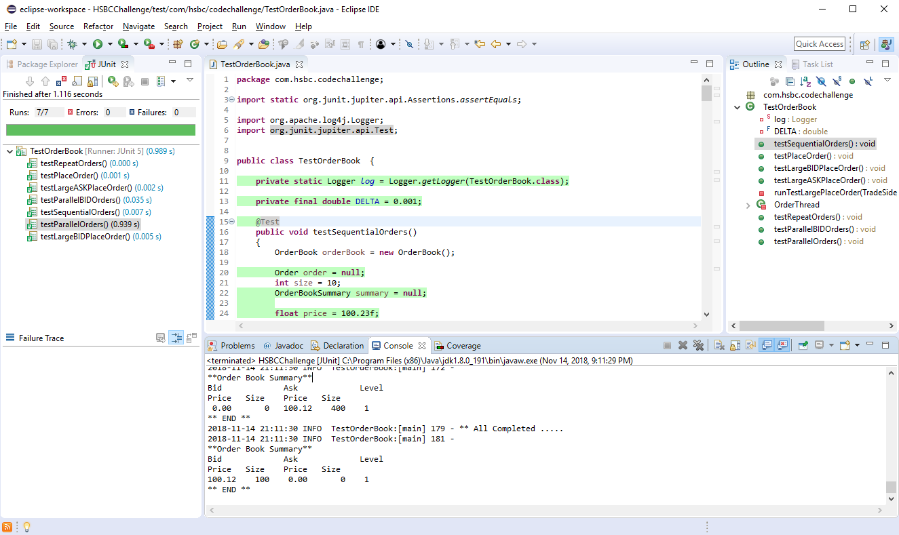
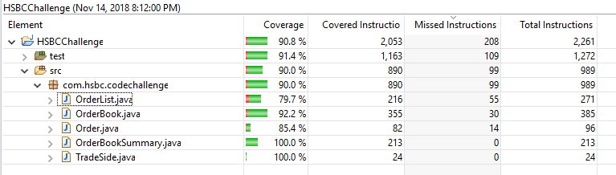

HSBC Code Challenge
===================
This is an implementation of HSBC Code Challenge for trading order book with matching capability.

Design for this solution is straightforward.

An OrderBook class to encapsulate the whole order book.
Order object for individual order.
Within an order book, there are multiple OrderList, which queue all orders for a particular price level. There are seperate order list for BID/ASK side.
There is an OrderBookSummary class to present order summary, which tell the open position on each price level and quantity available.

Sample like this: 
**Order Book Summary** 
Bid		Ask		Level  
Price	Size	Price	Size  
101.12	  300	102.00	  100	 1 
100.12	  400	103.10	  500	 2 
** END ** 

TEST
====
Proper unit test to validate all functionality, including functional scenarios and concurrency case. 

All result passed properly. 

Unit test coverage is appropriate and around 90%. 

Getting Started
================
This project require Java 8 and Maven to run/build.

Simple check out the project and run this Maven commmand.
mvn clean install

